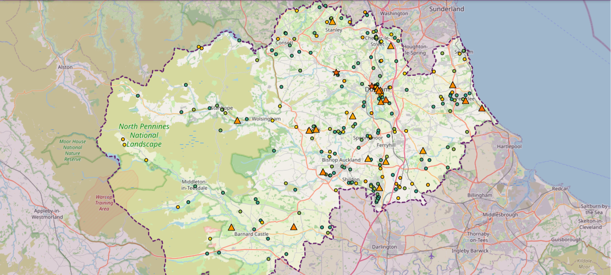

# Flood Risk Prioritisation for Grid Assets

> Combining flood, terrain and energy-asset data to map the exposure of, screen, and prioritise substations and distributed energy resources (DERs) in County Durham for further study, supported by a reproducible data and visualisation workflow.

| EPSRC-funded [Vacation Internship](https://www.ukri.org/what-we-do/developing-people-and-skills/research-skills-initiatives/apprenticeships-internships-and-placements/internships-and-placements/) Project |
| :--- |
| Associated with the UKRI grant: "Satellite-Aided Technologies for advancing resilience - Guarding energy services under climate hazards, risks, and disasters (SAT-Guard)" [UKRI Gateway](https://gtr.ukri.org/projects?ref=MR%2FZ50578X%2F1) |
| Student Research Associates: [Isabelle Servonat][servonat], [Oscar Ryley][ryley] |
| Supervisors: [Prof. Hongjian Sun][sun], [Dr Wenzhu Li][li], and [Dr Misael Alpizar Santana][santana] |

[servonat]: https://www.linkedin.com/in/isabelleservonat/
[ryley]: https://oryley.com/
[sun]: https://www.durham.ac.uk/staff/hongjian-sun/
[li]: https://www.durham.ac.uk/staff/wenzhu-li/
[santana]: https://www.durham.ac.uk/staff/misael-alpizar-santana/


## Live Site - [floodrisk.oryley.com](https://floodrisk.oryley.com)

[](https://floodrisk.oryley.com)
*Map of Substations in County Durham Case Study, Risk Levels Classified as High (red star), Medium (orange triangle), Low (Green circle). Not pictured but available visualisations: Not at Risk substations (Blue circles), Live Power Cuts (Black Lightning Bolts).*

## Data

### 📁 Directory Structure

```text
public/data/
├── images/
├── county_durham.geojson
├── powercut_archive.geojson
├── substation_sites_list.geojson
├── substation_sites_processed.geojson
├── substations_all.csv
├── LIDAR_Composite_10m_DTM_2022.tif
├── RoFRS/
│   ├── rofrs_4band_0_2m_depth/
│   ├── rofrs_4band_0_3m_depth/
│   ├── rofrs_4band_0_6m_depth/
│   ├── rofrs_4band_0_9m_depth/
│   └── rofrs_4band_1_2m_depth/
└── RoFSW/
    ├── rofsw_0_2m_depth/
    ├── rofsw_0_3m_depth/
    ├── rofsw_0_6m_depth/
    ├── rofsw_0_9m_depth/
    └── rofsw_1_2m_depth/
```

- `county_durham.geojson`: [MapIt Durham County Council Area - ID 2223](https://mapit.mysociety.org/area/2223.geojson) <i>(renamed from `2223.geojson`)</i>
- `powercut_archive.geojson`: Updated every 30 minutes by a GitHub Action that calls Northern Powergrid's [OpenDataSoft API](https://northernpowergrid.opendatasoft.com/explore/dataset/live-power-cuts-data/information/) and flood warnings from [the Environment Agency](https://environment.data.gov.uk/flood-monitoring/id/floods). Each run appends a new line, which is a timestamped GeoJSON snapshot.
- `substation_sites_list.geojson`: List of all substations with data points [Northern Power Grid Open Data](https://northernpowergrid.opendatasoft.com/explore/dataset/substation_sites_list/export/?disjunctive.dno_area)
- `substation_sites_filtered.geojson`: Generated based on the other data sources by the python file `scripts\archive_powercuts.py`. Used on [the live site](https://floodrisk.oryley.com).
- `substation_sites_all.csv`: Full Microsoft Excel csv export of data process during the project.


The following data is not tracked in git and must be downloaded and placed in `public/data/` before running the pipeline:
- `LIDAR_Composite_10m_DTM_2022.tif`: LIDAR Composite Digital Terrain Model (DTM) – 10m Resolution [Defra / Environment Agency Data Services Platform](https://environment.data.gov.uk/dataset/ce8fe7e7-bed0-4889-8825-19b042e128d2)
- `RoFRS`: Risk of Flooding from Multiple Sources at 0.2m, 0.3m, 0.6m, 0.9m, 1.2m depth thresholds in seperate folders from the [Defra Data Services Platform - RoFRS](https://environment.data.gov.uk/explore/8651d5af-be8c-4990-8ac9-c4ecd3cd1d6a?download=true)
- `RoFSW`: Risk of Flooding from Surface Water at 0.2m, 0.3m, 0.6m, 0.9m, 1.2m depth thresholds in seperate folders from the [Defra Data Services Platform - RoFSW](https://environment.data.gov.uk/explore/b5aaa28d-6eb9-460e-8d6f-43caa71fbe0e?download=true)


### ⚡ Dynamic Data

- **Live Power Cut Data**: Northern Powergrid's [OpenDataSoft API](https://northernpowergrid.opendatasoft.com/explore/dataset/live-power-cuts-data/information/)
- **Risk of Flooding from Surface Water Map**: Environment Agency [Web Map Service (WMS)](https://environment.data.gov.uk/dataset/b5aaa28d-6eb9-460e-8d6f-43caa71fbe0e)


### 🧪 Reproducibility

- Live site is currently available at [floodrisk.oryley.com](https://floodrisk.oryley.com)
- Static Data downloads can be found in [Directory Structure](#-directory-structure), including some data not tracked in git.
- A GitHub Actions workflow is archiving live Northern Power Grid power cut data, with flood warnings, to the repository. To create snapshots locally, run `scripts/archive_powercuts.py` and it will update `data/powercut_archive.geojson`
- To use this visualisation locally, clone this repository, and run using a local test server

```bash
git clone https://github.com/Oscar-Ryley/Flood-Risk.git
cd Flood-Risk
```


## Citation

**BibTeX:**
```bibtex
@misc{servonat_ryley_2026_floodrisk,
  author       = {Servonat, Isabelle and Ryley, Oscar and Sun, Hongjian and Li, Wenzhu and Alpizar Santana, Misael},
  title        = {Flood Risk Exposure Mapping for Energy Resources in the Durham Area},
  year         = {2026},
  publisher    = {GitHub},
  journal      = {GitHub Repository},
  howpublished = {\url{https://github.com/oscar-ryley/flood-risk}},
  note         = {EPSRC Vacation Internship Project, Associated with UKRI Grant MR/Z50578X/1}
}
```
